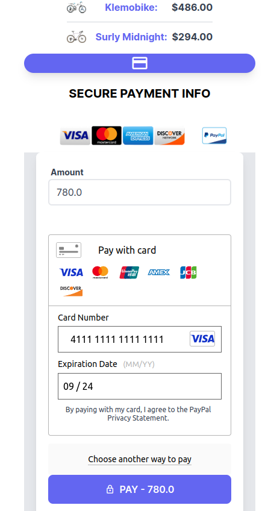
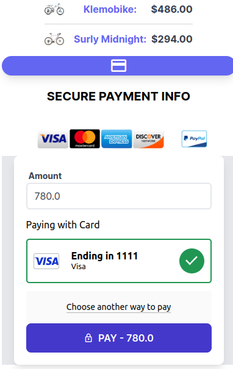

# Web Payment System with Braintree and GraphQL.
This web payment system integrates Braintree for payment processing using GraphQL. It consists of two main components: `ChargesController` for processing user payments and `Admin::PaymentsController` for displaying transactions.

 | 
:-------------------------:|:-------------------------:
Payment1           | Payment2 

## Introduction

his web payment system is built with Ruby on Rails and Braintree, a popular payment gateway. It allows users to make payments securely and administrators to view transaction details. The system uses GraphQL for communication with the Braintree gateway.

## Additional Resources

For more in-depth information and best practices on implementing Web Payment System in Ruby on Rails, check out our comprehensive article:

[Web Payment System in Ruby on Rails - Best Practices](https://medium.com/@dejanvu.developer/implementing-web-push-notifications-in-a-ruby-on-rails-application-dcd829e02df0)

## Features

- **User Payment Processing**: Users can make payments securely using Braintree.
- **Admin Transaction List**: Administrators can view a list of successful transactions.
- **GraphQL Integration**: The system uses GraphQL to communicate with Braintree.

## Installation

### Prerequisites

- Ruby on Rails should be installed.
- You need a Braintree account and API credentials.
- Set up your Rails application and configure your database.


### Installation Steps

Clone this repository to your local development environment:

1. Clone the repository:

```bash
git clone https://github.com/DeVuDeveloper/payment.git
cd payment

2. Install the required gems:

```bash
 bundle install
 bin/setup
```

3. Set up the database:

```bash
  rails db:create
  rails db:migrate
  rails db:seed
```

4. Set up your Braintree credentials in the .env file(or Rails Credentials):

```bash
  BRAINTREE_MERCHANT_ID=your_merchant_id
  BRAINTREE_PUBLIC_KEY=your_public_key
  BRAINTREE_PRIVATE_KEY=your_private_key
```

5. Run the server(Open your Browser and navigate to url: http://localhost:3000/): 

```bash
  bin/dev
```

## Linter

The Push Notifications App a linter. You can run the linter with the following command:

```bash
  rubocop && rubocop -A
```

## Testsing
To ensure that your web payment system works correctly, follow these testing steps:

1. Install any required testing dependencies if you haven't already.

2. Execute the tests to verify that transactiaons are made and displayed as expected.

```bash
  rspec spec
```

### Usage

**ChargesController**

The `ChargesController` handles user payments. It uses Braintree for processing transactions and GraphQL for communication.

- `GET /charges/new`: Renders the payment page.
- `POST /charges`: Processes the payment and redirects to a new payment page with a success message if the transaction is successful.

**Admin::PaymentsController**

The `Admin::PaymentsController` is for administrators to view transaction details.

- `GET /admin/payments`: Lists successful transactions.


## Built With 🔨

<div align="center">

|     | Languages                                                                                                                                                                                                                                                                                                                  |     |
| --- | -------------------------------------------------------------------------------------------------------------------------------------------------------------------------------------------------------------------------------------------------------------------------------------------------------------------------- | --- |
|     | ! |

<div align="center">


|     | Tools 🛠️                                                                                                                                                                                                                                                                                                                                                                                                                                                                              |     |
| --- | ------------------------------------------------------------------------------------------------------------------------------------------------------------------------------------------------------------------------------------------------------------------------------------------------------------------------------------------------------------------------------------------------------------------------------------------------------------------------------------- | --- |
|     |     |     |

<p align="right">(<a href="#top">back to top</a>)</p>
</div>

## Authors ✍️

<div align="center">

| 👤 DeVuDeveloper|
| -------- |

| <a target="_blank" href="https://github.com/DeVuDeveloper"></a> <a target="_blank" href="https://www.linkedin.com/in/devuj/"></a> <a target="_blank" href="https://twitter.com/DejanVuj"></a>
|

</div>

<p align="right">(<a href="#top">back to top</a>)</p>

## Acknowledgments

- Braintree

Happy coding!

